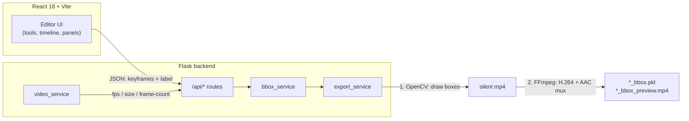
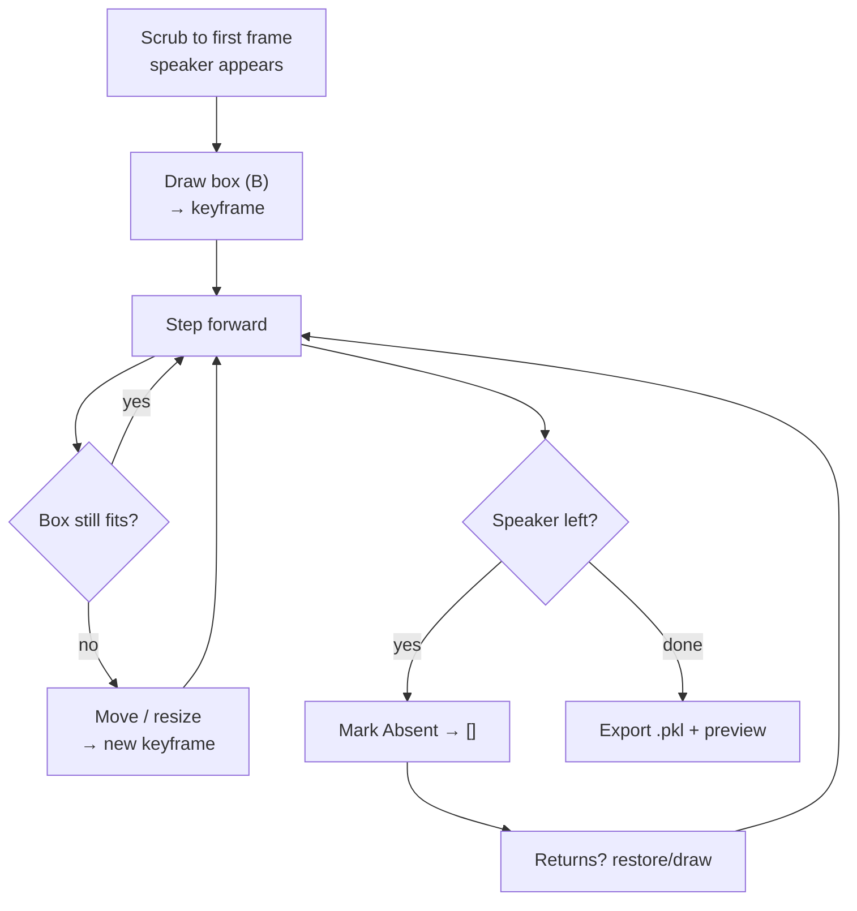

[](https://www.python.org/)
[](https://flask.palletsprojects.com/)
[](https://react.dev/)
[](https://opencv.org/)
[](https://ffmpeg.org/)

# FaceTrack Annotator

Keyframe-based speaker face-tracking tool built for a **lip-sync dubbing pipeline**.
Annotate one speaker per session: draw / move / resize a bounding box, mark
absent segments, and export a per-frame pickle plus an H.264 preview with audio —
ready to feed into a lip-sync model.

> **Status:** core annotation + export loop is complete and verified end-to-end
> (567-frame video → exact-length `.pkl` + playable preview with muxed audio).

## Demo

- App: run locally → `http://127.0.0.1:5000`
- Walkthrough video (Loom): _link added at submission time_

## Features

| # | Capability | Notes |
|---|-----------|-------|
| 1 | Multi-speaker tracks | Per-speaker keyframes, colors, show/hide, add/remove |
| 2 | Draw / Move / Resize / Delete tools | Keyboard: `B` `M` `R` `Del`, every edit = keyframe |
| 3 | Forward-fill, **no interpolation** | Each keyframe copies forward unchanged until the next |
| 4 | Speaker Absent / Returns | Absent exports `[]`; Returns restores last box in one click |
| 5 | Frame-accurate transport | Play, ±1 / ±10 steps, timeline scrubber, timecode |
| 6 | Filmstrip + multi-lane timeline | Coverage segments, diamond keyframes, zoom, click/right-click |
| 7 | Undo / redo | `Ctrl+Z` / `Ctrl+Y` over full project state |
| 8 | Numeric bbox editing | X / Y / Width / Height fields commit keyframes |
| 9 | Save / Open project | Whole session as `.ftrack.json` |
| 10 | Export `.pkl` + `.mp4` preview | H.264 + AAC (source audio muxed), download modal |

## Architecture





## Quickstart

**Prerequisites:** Python 3.12 + venv, Node 18+, FFmpeg on PATH.

```bash
# 1. backend deps (venv lives in backend/.venv)
python3 -m venv backend/.venv
source backend/.venv/bin/activate
pip install -r backend/requirements.txt

# 2. frontend build (once; Flask serves it)
cd frontend && npm install && npm run build && cd ..

# 3. run — single server (use this for the demo recording)
python backend/main.py --video /path/to/video.mp4 --port 5000 --outdir ./outputs
# open http://127.0.0.1:5000
```

**Dev mode** (UI hot-reload + Flask API):

```bash
# terminal 1
python backend/main.py --video /path/to/video.mp4 --port 5000
# terminal 2
cd frontend && npm run dev   # → http://127.0.0.1:5173 (proxies /api)
```

| CLI flag | Default | Meaning |
|----------|---------|---------|
| `--video` | _(required)_ | Input video path (`.mp4` / `.mov`) |
| `--port` | `5000` | HTTP port |
| `--host` | `127.0.0.1` | Bind address |
| `--outdir` | `outputs` | Where `.pkl` + preview are written |

> `.mov` won't play in some browsers? Remux without re-encoding:
> `ffmpeg -i in.mov -c copy out.mp4`

## Annotation workflow (fast path)

1. Pick the speaker in **Speaker Selection** (add more with **Add Speaker**).
2. Scrub to its first visible frame → **Draw (B)** a tight face box.
3. Step with `→` / timeline; when the box drifts, drag inside (move) or a
   corner/edge pill (resize) — each edit is a keyframe, copied forward.
4. Speaker leaves the frame → **Speaker Absent**. Returns → **Speaker Returns**.
5. Wrong keyframe → select it and press `D`, or right-click its timeline diamond.
6. **Export** with an output name (e.g. `speaker`, `speaker_1`) → download both
   files from the result dialog.

### Shortcuts

| Key | Action |
|-----|--------|
| `Space` | Play / pause |
| `←` `→` / `Shift` | ±1 / ±10 frames |
| `B` `M` `R` `Del` | Draw / Move / Resize / Delete tool |
| `K` | Pin keyframe here · `N` absent · `D` delete key · `E` export |
| `Ctrl+Z` / `Ctrl+Y` | Undo / redo · `Esc` closes dialogs |

## Export format

- **`{label}_bbox.pkl`** — Python pickle: list with **exactly one entry per source
  frame**; `[x1, y1, x2, y2]` integer pixels (top-left origin) or `[]` when absent.
- **`{label}_bbox_preview.mp4`** — same frames with box + `FRAME n` burned in,
  H.264 + AAC (original audio muxed back via FFmpeg).
- Validate: `len(pickle.load(open(pkl,'rb'))) == total_frames`.

## API

| Method | Route | Purpose |
|--------|-------|---------|
| `GET` | `/api/metadata` | fps, size, frame count |
| `GET` | `/api/video` | source video bytes (range requests) |
| `POST` | `/api/upload` | switch video (`multipart: file`) |
| `POST` | `/api/export` | `{keyframes, label}` → pkl + preview |
| `GET` | `/api/download/{name}` | fetch `*_bbox.pkl` / `*_bbox_preview.mp4` |

## Project structure

```
video_bbox_app/
├── backend/
│   ├── main.py              # CLI entry point
│   ├── config.py            # AppConfig (paths, ports)
│   ├── routes/api.py        # REST endpoints
│   ├── routes/views.py      # serves React build
│   └── services/
│       ├── video_service.py # cv2 probing
│       ├── bbox_service.py  # keyframe model + forward-fill
│       └── export_service.py# pickle + H.264/AAC preview
├── frontend/src/
│   ├── App.jsx              # shell + shortcuts + project I/O
│   ├── components/          # TopBar, SideLeft/Right, VideoStage,
│   │                        # PlayerBar, Timeline, ExportPanel, icons
│   ├── hooks/useTracks.js   # multi-speaker store + undo/redo
│   └── utils/               # bbox math, api client
└── docs/banner.svg
```

## Assumptions & limitations

- One speaker annotated per export run (repeat per speaker for multi-speaker dubs).
- Constant FPS; frame index = `round(currentTime × fps)` (±1 tolerance, OpenCV
  count is authoritative).
- Fully manual tracking (per spec) — a face-detector seeding step
  (`detect_service.py`) is the natural next addition; `services/` is ready for it.
- No interpolation by design; fast motion needs denser keyframes.
- Without FFmpeg on PATH, preview falls back to silent `mp4v`.

## Roadmap

- [ ] Detector-seeded keyframes (face detection → hand correction)
- [ ] Waveform lane on the timeline for speech-aware range selection
- [ ] Per-range lip-sync planner (Section 2 style) built into the timeline
- [ ] Docker image for one-command runs
