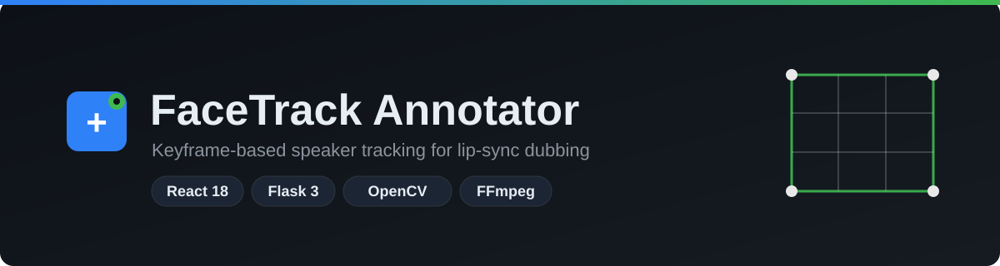

[](https://www.python.org/)
[](https://react.dev/)
[](https://flask.palletsprojects.com/)

# FaceTrack Annotator

Keyframe-based speaker tracking for lip-sync dubbing. Draw a box, step through
frames, mark absent segments, export a per-frame pickle + H.264 preview.

## Run

```bash
python3 -m venv backend/.venv && source backend/.venv/bin/activate
pip install -r backend/requirements.txt

cd frontend && npm install && npm run build && cd ..

python backend/main.py --video /path/to/video.mp4 --outdir ./outputs
# → http://127.0.0.1:5000
```

> `.mov` won't play in-browser? `ffmpeg -i in.mov -c copy out.mp4`

## Use

1. Scrub to the speaker's first frame → draw a box (`B`)
2. Step forward (`→`) → move / resize when it drifts — each edit is a keyframe
3. Speaker leaves → `N` (absent) · returns → restore or redraw
4. Wrong keyframe → `D` · Export → `E`

## Export

- `{name}_bbox.pkl` — one entry per frame: `[x1, y1, x2, y2]` or `[]`
- `{name}_bbox_preview.mp4` — same frames, box + frame number, H.264 + AAC

## Layout

```
backend/   Flask API (routes/) + services (video, bbox, export)
frontend/  React 18 + Vite (components, hooks, utils)
```

## Notes

- Forward-fill, no interpolation. Constant-FPS assumed.
- Manual tracking by design; detector seeding is the natural next step.
- Without FFmpeg, preview falls back to silent `mp4v`.
